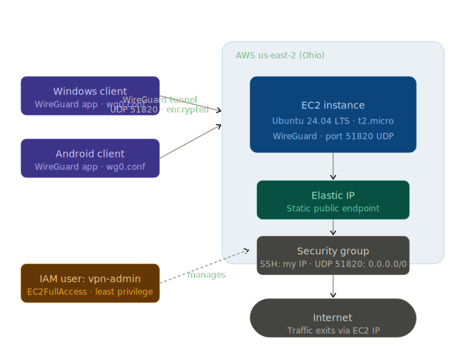

# WireGuard VPN Server on AWS EC2

> This repository serves as documentation of a personal cloud infrastructure project, built for hands-on AWS experience and portfolio purposes.

A self-hosted VPN server built on AWS EC2 using WireGuard, configured for private browsing and traffic routing through a cloud-based endpoint.

---

## Devlog

### v1.0 — Initial Setup
*June 8, 2026*

#### Overview
The goal was to route client device traffic through a cloud-hosted server for private browsing, using AWS infrastructure rather than a third-party VPN service.

#### Architecture
- **EC2 Instance:** Ubuntu Server 24.04 LTS, t2.micro
- **Region:** us-east-2 (Ohio)
- **VPN Protocol:** WireGuard on UDP port 51820
- **IAM:** Dedicated IAM user with least-privilege EC2 access, separate from root
- **Security Group:** SSH access restricted to known IP, WireGuard port open to all

#### Setup Summary
1. Created a dedicated IAM user with EC2FullAccess, following least-privilege principles
2. Launched an Ubuntu EC2 instance with a custom security group allowing SSH and WireGuard traffic
3. Installed WireGuard and generated server and client key pairs
4. Configured server with IP forwarding and iptables NAT rules for traffic routing
5. Troubleshot network interface naming (ens5 vs eth0) and updated PostUp/PostDown rules accordingly
6. Generated a client config and connected a Windows machine via the WireGuard client

#### Client Config Structure
```ini
[Interface]
PrivateKey = <client_private_key>
Address = 10.0.0.2/24
DNS = 1.1.1.1

[Peer]
PublicKey = <server_public_key>
Endpoint = <ec2_public_ip>:51820
AllowedIPs = 0.0.0.0/0
PersistentKeepalive = 25
```

#### Cost Management
To avoid unnecessary charges the EC2 instance is stopped when not in use. The instance is only running during active VPN sessions, keeping costs minimal (cents per hour of use).

---

### v1.1 — Elastic IP Migration
*June 8, 2026*

**Problem:** EC2's default public IP changes every time the instance is stopped and started, requiring manual updates to the `Endpoint` field in every client config after each restart. With multiple devices connected this quickly becomes impractical.

**Solution:** Allocated and associated an Elastic IP with the instance. The static endpoint now persists across stop/start cycles, meaning client configs are configured once and never need to be touched again.

**Tradeoff:** A small charge of ~$0.005/hr applies while the instance is stopped but the Elastic IP remains allocated. This is still significantly cheaper than a third-party VPN subscription while maintaining full control over the infrastructure.

**Additional change:** Expanded client support to include an Android device in addition to the Windows machine.

---

## Current Architecture



- **EC2 Instance:** Ubuntu Server 24.04 LTS, t2.micro
- **Region:** us-east-2 (Ohio)
- **VPN Protocol:** WireGuard on UDP port 51820
- **Elastic IP:** Static public endpoint, persists across instance stop/start cycles
- **IAM:** Dedicated IAM user with least-privilege EC2 access, separate from root
- **Security Group:** SSH access restricted to known IP, WireGuard port open to all
- **Clients:** Windows, Android

## Skills Demonstrated

- AWS EC2 instance provisioning and management
- Elastic IP allocation and association for static endpoint management
- IAM user creation and least-privilege permission scoping
- Security group configuration and inbound rule management
- Linux server administration (Ubuntu, systemctl, iptables)
- WireGuard VPN server and client configuration
- Network troubleshooting (interface naming, IP forwarding, NAT)
- Iterative infrastructure improvement based on real usage
